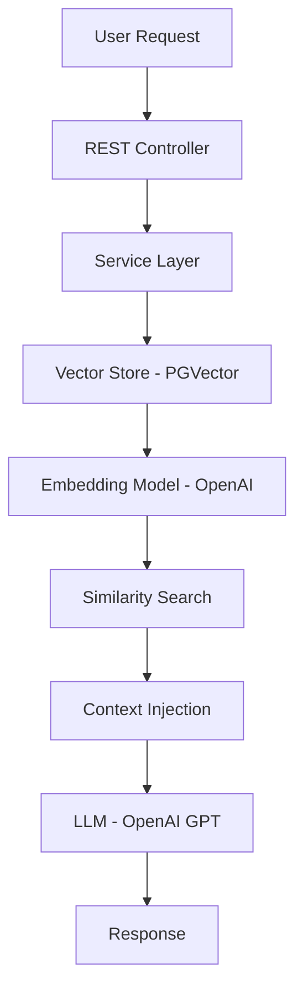

# 🚀 Spring AI RAG System with PGVector & OpenAI

A production-ready Retrieval-Augmented Generation (RAG) system built using:

- Spring Boot 3
- Spring AI
- PostgreSQL + pgvector
- OpenAI (Embeddings + LLM)
- Docker

This project demonstrates modern AI system design integrated into a clean, scalable backend architecture suitable for enterprise environments.

---

# 📌 Project Overview

This application implements a Retrieval-Augmented Generation (RAG) pipeline:

1. Documents are ingested and converted into vector embeddings.
2. Embeddings are stored in PostgreSQL using pgvector.
3. User queries are embedded and matched using vector similarity search.
4. Retrieved context is injected into an LLM prompt.
5. The LLM generates grounded, context-aware responses.

The system ensures responses are based strictly on stored domain data, reducing hallucinations and improving reliability.

---

# 🧠 Why This Project Matters

This project demonstrates:

- Real-world AI backend integration
- Vector database usage
- Semantic search implementation
- LLM prompt engineering
- Cost-aware AI architecture
- Clean layered Spring architecture
- Containerized infrastructure

It bridges traditional backend engineering with modern AI system design.

---

## Architecture Diagram



---

# 🔎 Technical Deep Dive

## 1️⃣ Document Ingestion

When a document is added:

- Text is sent to the embedding model.
- A high-dimensional vector is generated (e.g., 1536 dimensions).
- The vector and original content are stored in PostgreSQL.

This allows semantic similarity comparison rather than keyword matching.

---

## 2️⃣ Query Flow

When a user asks a question:

1. The query is embedded.
2. Vector similarity search retrieves top-K relevant documents.
3. Documents are merged into structured prompt context.
4. The LLM generates a response using only retrieved context.

This enforces grounding and reduces hallucinations.

---

# 🧰 Tech Stack

| Layer | Technology |
|--------|------------|
| Backend | Spring Boot 3 |
| AI Integration | Spring AI |
| Vector Database | PostgreSQL + pgvector |
| LLM Provider | OpenAI |
| Containerization | Docker |
| Build Tool | Maven |
| Java Version | 17+ |

---

# 🐳 Infrastructure Setup

## Run PostgreSQL with pgvector

```bash

docker-compose up -d

Container includes:
PostgreSQL 16
pgvector extension

Database:
Name: ragdb
User: postgres
Password: postgres

⚙️ Application Configuration

application.yml

spring:
  datasource:
    url: jdbc:postgresql://localhost:5432/ragdb
    username: postgres
    password: postgres

  ai:
    openai:
      api-key: ${OPENAI_API_KEY}
      embedding:
        options:
          model: text-embedding-3-small

    vectorstore:
      pgvector:
        initialize-schema: true
        
▶️ Running the Application

mvn clean install
mvn spring-boot:run

🧪 API Endpoints

Add Document
curl -X POST http://localhost:8080/api/rag/documents \
     -H "Content-Type: text/plain" \
     -d "Spring Boot is a Java framework for building microservices."

Ask Question
curl --get http://localhost:8080/api/rag/ask \
     --data-urlencode "question=What is Spring Boot?"
   ```

## 📊 Engineering Considerations

## ✔ Scalability
Vector search indexed with pgvector
Top-K configurable
Embeddings cached strategy-ready
Dockerized for cloud deployment

## ✔ Performance
Embedding model is lightweight and cost-efficient
Similarity search happens inside PostgreSQL
Stateless service layer for horizontal scaling

## ✔ Security
API key externalized via environment variables
No sensitive data stored in prompts
Database credentials configurable

## ✔ Extensibility

Can be extended with:

PDF ingestion + automatic chunking
Metadata filtering
Streaming responses
Multi-tenant isolation
Hybrid search (BM25 + vector)
Observability (Micrometer, OpenTelemetry)

## 🧩 Advanced Improvements (Production Roadmap)

Add token-aware context truncation
Add vector index tuning
Add response caching
Add rate limiting
Add circuit breaker for LLM calls
Add prompt versioning
Add audit logging for AI interactions
Add evaluation metrics (RAG accuracy testing)

## 🧠 Senior-Level Concepts Demonstrated

Separation of concerns (Controller / Service / AI layer)
Clean prompt engineering
AI cost-awareness
Retrieval pipeline design
Infrastructure as code
Container-based local development
JVM ecosystem + AI integration
Understanding of embedding vs generation models
Understanding of vector similarity metrics

## 📈 Production Deployment Strategy

## Recommended cloud deployment:

App: Kubernetes / ECS / Azure Container Apps
DB: Managed PostgreSQL with pgvector
Secrets: Vault / AWS Secrets Manager
Observability: Prometheus + Grafana
LLM: External provider (OpenAI) or self-hosted model


## This project showcases:

Modern AI system integration
Backend architectural maturity
Clean, production-grade engineering practices
Understanding of vector databases
Understanding of LLM lifecycle
Cost/performance trade-offs
Practical GenAI backend implementation


## 👤 Author
Senior backend engineer exploring AI-native system design and production-grade GenAI integration within the Spring ecosystem.

## 📄 License
  MIT